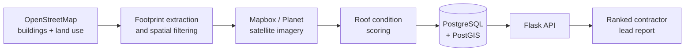

# MapWork.ai

### From satellite imagery to contractor-ready commercial roofing leads

MapWork.ai is a geospatial lead-generation pipeline for commercial roofing teams. It finds industrial buildings, filters their footprints, pairs them with satellite imagery, and ranks roofs that may deserve a closer inspection.

> **[Try the interactive roof-scan simulation](https://s34tiwar.github.io/Geospatial-Data-Processing-Platform-/)**
>
> No API keys or installation required. The public demo uses clearly labelled synthetic scores so the product flow is easy to explore without presenting simulated analysis as a real inspection.

## Why I built it

Commercial roofers often qualify prospects through cold outreach and manual map research. I wanted to see whether the geospatial data already surrounding us could turn that repetitive search into a useful shortlist. Conversations with local roofing professionals helped validate the problem and pushed the project from a technical experiment toward a product shaped around a real workflow.

## What the demo shows

1. Select a Waterloo Region industrial area.
2. Run a simulated satellite scan across building footprints.
3. Adjust the minimum opportunity score.
4. Inspect and export a ranked list of candidate properties.

The score in the public demo is synthetic. In the production architecture it is intended to be replaced by a validated computer-vision model and human review; MapWork.ai flags candidates, not confirmed roof damage.

## Pipeline



## Repository guide

| Path | Purpose |
| --- | --- |
| [`docs/`](docs/) | Zero-dependency interactive product simulation, ready for GitHub Pages |
| [`Geospatial Data Processing Platform/main.py`](Geospatial%20Data%20Processing%20Platform/main.py) | OSM ingestion, spatial filtering, geocoding, imagery retrieval, and persistence |
| [`Geospatial Data Processing Platform/app.py`](Geospatial%20Data%20Processing%20Platform/app.py) | Flask backend and Postgres connectivity check |
| [`Geospatial Data Processing Platform/planet_service.py`](Geospatial%20Data%20Processing%20Platform/planet_service.py) | Planet imagery search and processing |
| [`Geospatial Data Processing Platform/sentinel_service.py`](Geospatial%20Data%20Processing%20Platform/sentinel_service.py) | Sentinel Hub imagery integration |

## Run locally

The simulation is a static site:

```bash
python3 -m http.server 8080 --directory docs
```

Open `http://localhost:8080`.

For the backend:

```bash
cd "Geospatial Data Processing Platform"
python3 -m venv .venv
source .venv/bin/activate
pip install -r requirements.txt
python app.py
```

Database and imagery integrations require environment variables such as `POSTGRES_*`, `MAPBOX_TOKEN`, `PL_API_KEY`, and optional AWS credentials. Never commit those values.

## Current status

- Implemented: OSM/Overpass ingestion, industrial-zone filtering, footprint processing, reverse geocoding, PostGIS persistence, imagery service integrations, and interactive product simulation.
- In progress: validated roof-condition model, production authentication, and CRM delivery.
- Next: label an imagery dataset with roofing experts, benchmark model precision/recall, and pilot the ranked workflow with local contractors.

## Responsible use

Satellite signals can be stale or ambiguous. A high score is an invitation to investigate—not proof of damage. Any production version should show imagery dates, confidence, and model limitations, then require a qualified professional to confirm roof condition.
